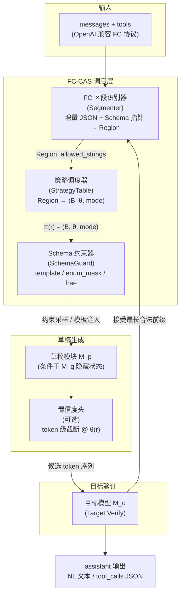

# 图 1 系统架构

面向标准 JSON Function Call 的区段感知投机解码系统。输入为 `messages` + `tools`；输出经目标模型验证后回填对话。

**模块对应关系**

| 附图模块 | 代码路径 | 职责 |
|---------|---------|------|
| FC 区段识别器 | `fc_cas/segmenter/json_fc.py` | 判定 NL / TOOL_SKELETON / TOOL_ENUM / TOOL_FREE |
| 策略调度器 | `fc_cas/strategy/table.py` | 查表返回 block_size、confidence_threshold、mode |
| Schema 约束器 | `fc_cas/schema/guard.py` | 枚举掩码、骨架模板注入 |
| 草稿 + 验证 | DeepSpec DSpark 桥（Phase 4+） | 生成候选并由 M_q 并行验证 |
