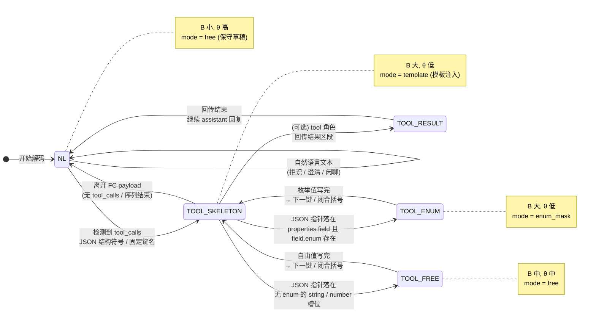

# 图 2 标准 JSON Function Call 区段状态机

解码过程中维护输出区段状态；识别信号包括聊天模板边界、增量 JSON 语法状态（键名 / 字符串值 / 结构符号）及 tools Schema 字段指针。

**默认策略（DESIGN §4.2，可标定）**

| Region | block_size B | confidence θ | mode |
|--------|-------------|--------------|------|
| NL | 4 | 0.6 | free |
| TOOL_SKELETON | 24 | 0.2 | template |
| TOOL_ENUM | 16 | 0.2 | enum_mask |
| TOOL_FREE | 8 | 0.4 | free |
