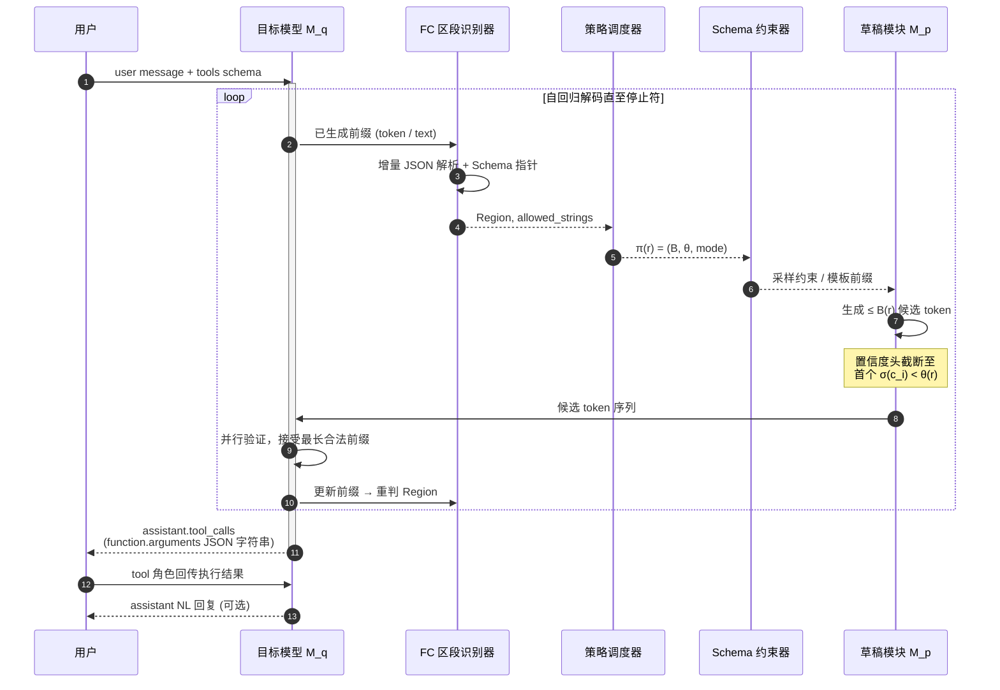

# 图 3 单轮 FC 投机解码时序

用户 utterance 触发 assistant 生成；若需调用工具则序列化 `tool_calls`，tool 角色回传结果后 assistant 可继续 NL 回复。图中展示一次解码步内的区段感知投机循环。

**时序要点**

1. 每步解码前先经 Segmenter 判定当前 Region，再查 StrategyTable 得差异化超参。  
2. SchemaGuard 仅在 TOOL_SKELETON / TOOL_ENUM 区段施加约束；NL / TOOL_FREE 回退普通草稿。  
3. 目标模型始终执行验证，保持与 M_q 分布一致的无损加速路径。
